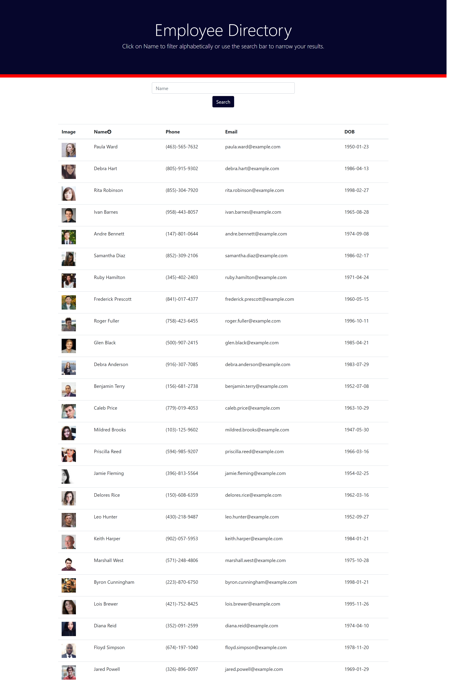

# Employee Directory

## Description
Employee Directory is a React application.  It allows the user to view a table of employee information and sort the employees alphabetically by name.


## Table of Contents
- [Description](#Description)
- [Installation](#Installation)
- [Usage](#Usage)
- [License](#License)
- [Contributing](#Contributing)
- [Badges](#Badges)
- [Questions](#Questions)
- [Credits](#Credits)

---

## Installation
To install the application, fork the [GitHub repo](https://github.com/Jacquie24/employee-directory) and download the contents to your local server.  You must run npm install to install the required dependencies.  Then the app will run with npm start.

---

## Usage
Click [here](https://jacquie24.github.io/employee-directory/) for the deployed application.  The employee table compiles upon page load.  It includes image, name, email, and date of birth for each employee.  Click on the arrow next to Name, and it will sort alphabetically by last name.  

---

## License
This application is covered under MIT License

<details>
  <summary>
    License Text
  </summary> 

```

Copyright (c) 2021  Jacquie Gutierrez

Permission is hereby granted, free of charge, to any person obtaining a copy
of this software and associated documentation files (the "Software"), to deal
in the Software without restriction, including without limitation the rights
to use, copy, modify, merge, publish, distribute, sublicense, and/or sell
copies of the Software, and to permit persons to whom the Software is
furnished to do so, subject to the following conditions:
      
The above copyright notice and this permission notice shall be included in all
copies or substantial portions of the Software.
      
THE SOFTWARE IS PROVIDED "AS IS", WITHOUT WARRANTY OF ANY KIND, EXPRESS OR
IMPLIED, INCLUDING BUT NOT LIMITED TO THE WARRANTIES OF MERCHANTABILITY,
FITNESS FOR A PARTICULAR PURPOSE AND NONINFRINGEMENT. IN NO EVENT SHALL THE
AUTHORS OR COPYRIGHT HOLDERS BE LIABLE FOR ANY CLAIM, DAMAGES OR OTHER
LIABILITY, WHETHER IN AN ACTION OF CONTRACT, TORT OR OTHERWISE, ARISING FROM,
OUT OF OR IN CONNECTION WITH THE SOFTWARE OR THE USE OR OTHER DEALINGS IN THE
SOFTWARE.

```
</details>

---

## Contributing
Please contact the author of this application to request access to the repository as a contributor.

[Jacquie Gutierrez](https://github.com/Jacquie24)

---

## Badges
[](https://opensource.org/licenses/MIT)

---

## Questions
Please comment on the repository for this project, [employee directory](https://github.com/Jacquie24/employee-directory), and I will get back to you.

---

## References
* [Array.sort()](https://developer.mozilla.org/en-US/docs/Web/JavaScript/Reference/Global_Objects/Array/sort)
* [Random User API](https://randomuser.me/)